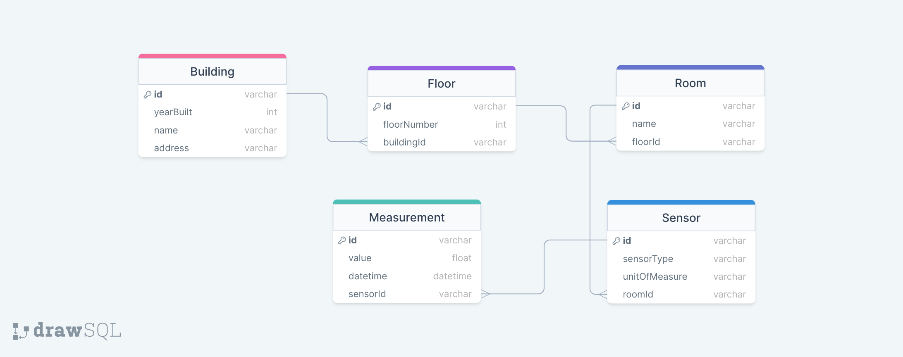

# DDB ORM Comparison: Sensor Management

## Compared libraries

- Dynamoose
- TypeDORM
- DynamoDB Toolbox
- DynamoDB One Table
- ElectroDB

## Prerequisites

- Node.js +18
- DynamoDB local
- Docker (optional)
- NoSQL workbench (optional)

## ER Diagram



## Getting started

1. Install dependencies:

```
yarn install
```

2. Start DDB locally using Docker, NoSQL Workbench or other:

```
yarn db:local
```

3. Create the table via the CFN or Workbench template in `assets/schema/`

4. (Optional) Purge your DB:

```
yarn init:sdk
```

5. Run one of the commands to test a certain ORM:

```
yarn init:dynamodb-onetable
yarn init:dynamodb-toolbox
yarn init:electrodb
yarn init:dynamoose
yarn init:typedorm
```

6. Check out your results in `src/${orm-name}/data/`

## Troubleshooting

If you see an error when running one command after another, try purging your DB using this command:

```
yarn init:sdk
```
